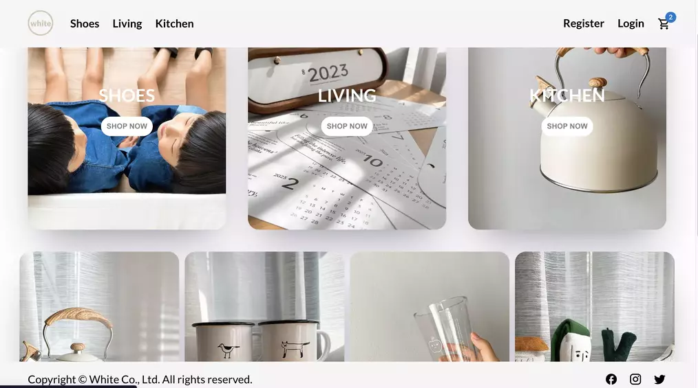

# It's all white

## Summary

Discover trending and fancy living accessories in it's all white online shop!

[Demo](https://allwhite.netlify.app/)




## Contents

## Stacks

- React 
- Redux Toolkit
- React Router
- Node 
- Express 
- MongoDB 
- JWT
- RESTful API 
- Stripe 
- styled-component

## Installation

### Clone the project

```
$ git clone git@github.com:christy313/white-front-end.git
$ cd white-front-end
```

### Install packages

`$ npm install`

### Start the server

`$ npm start`

## Future Improvement

- order list for each user

## File structure

```
.
├── README.md
└── src
    ├── App.jsx
    ├── App.test.js
    ├── components
    │   ├── Categories
    │   │   ├── Categories.styles.jsx
    │   │   └── index.jsx
    │   ├── CategoryItem
    │   │   ├── CategoryItem.styles.jsx
    │   │   └── index.jsx
    │   ├── Footer
    │   │   ├── Footer.styles.jsx
    │   │   └── index.jsx
    │   ├── Navbar
    │   │   ├── Navbar.styles.jsx
    │   │   └── index.jsx
    │   ├── Newsletter
    │   │   ├── Newsletter.styles.jsx
    │   │   └── index.jsx
    │   ├── Notice
    │   │   ├── Notice.styles.jsx
    │   │   └── index.jsx
    │   ├── Product
    │   │   ├── Product.styles.jsx
    │   │   └── index.jsx
    │   ├── Products
    │   │   ├── Products.styles.jsx
    │   │   └── index.jsx
    │   └── Slider
    │       ├── Slider.styles.jsx
    │       └── index.jsx
    ├── data
    │   ├── data.js
    │   └── products.json
    ├── index.css
    ├── index.js
    ├── logo.svg
    ├── pages
    │   ├── Cancel
    │   │   ├── Cancel.styles.jsx
    │   │   └── index.jsx
    │   ├── Cart
    │   │   ├── Cart.styles.jsx
    │   │   └── index.jsx
    │   ├── Home.jsx
    │   ├── Login
    │   │   ├── Login.styles.jsx
    │   │   └── index.jsx
    │   ├── ProductsList
    │   │   ├── ProductsList.styles.jsx
    │   │   └── index.jsx
    │   ├── Register
    │   │   ├── Register.styles.jsx
    │   │   └── index.jsx
    │   ├── SingleProduct
    │   │   ├── SingleProduct.styles.jsx
    │   │   └── index.jsx
    │   └── Success
    │       ├── Success.styles.jsx
    │       └── index.jsx
    ├── redux
    │   ├── apiCalls.js
    │   ├── cartRedux.js
    │   ├── store.js
    │   └── userRedux.js
    └── responsive.js
```